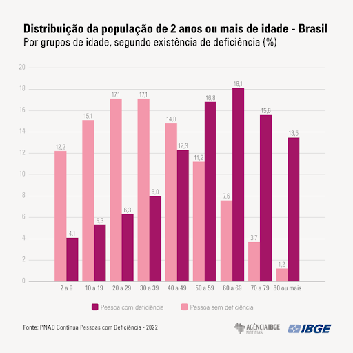

# Introdução

A falta de acessibilidade na mobilidade urbana é uma realidade na vida de milhares de pessoas ao redor do mundo. Pensando somente no Brasil, essa situação não é diferente e se manifesta nas irregularidades das calçadas, na falta de rampas de acesso para cadeirantes, na precarização de guias nas calçadas para deficientes visuais, dentre outros inúmeros cenários.
Segundo uma pesquisa feita pela PNAD Contínua Pessoas com Deficiência em 2022, publicada pelo portal de notícias do IBGE, observa-se no gráfico (1) um número significativo de pessoas com deficiência no Brasil.

  

Embora o país seja uma economia emergente dentre seus pares na América do Sul, essa falta de acesso respeitoso aos deficientes físicos é observada principalmente nos grandes centros urbanos, onde se concentram as pesquisas acerca do assunto em diversas publicações nos últimos 10 anos.

Um estudo realizado pela “Mobilize Brasil” mostrou que nenhuma das 27 capitais brasileiras possuem uma estrutura suficientemente adequada que permita a livre circulação de todos os segmentos de pedestres em suas ruas.

A partir do contexto apresentado, é possível fazer os seguintes questionamentos: Qual a importância de informar à população sobre locais que podem apresentar dificuldades no acesso à mobilidade urbana? Qual a importância de denunciar esses lugares? Qual o impacto gerado pela falta de acessibilidade?

A coleta e análise dos dados obtidos com a aplicação proposta neste projeto pode representar um grande passo na construção de uma sociedade mais inclusiva e mais preparada para atender as necessidades de qualquer pessoa, proporcionando uma melhor qualidade de vida para a população em geral.

Diante dos resultados obtidos com o estudo, esse projeto se apresenta como uma contribuição para a solução do problema. A proposta é oferecer à população uma plataforma onde elas possam denunciar pontos específicos da cidade onde sejam identificados aspectos que caracterizam uma situação de falta de acessibilidade quanto à mobilidade urbana. Além disso, a plataforma pode ser acessada pela população vulnerável ao problema com o objetivo de mantê-los informados acerca desses lugares.

Para atingir esse objetivo será feito um levantamento de aspectos que caracterizam um espaço inadequado, permitindo maior clareza sobre os diferentes tipos de impedimentos presentes nas ruas. Por outro lado, faz-se necessário estabelecer uma categorização dos indivíduos impactados por essas circunstâncias, dessa forma os dados levantados poderão ser analisados com maior precisão e ênfase nas necessidades específicas de cada pessoa.

Dentro do escopo do projeto, buscamos incluir e representar as necessidades de alguns grupos de pessoas como, os cadeirantes, os idosos, os deficientes visuais e, no geral, todas as pessoas com mobilidade reduzida.
