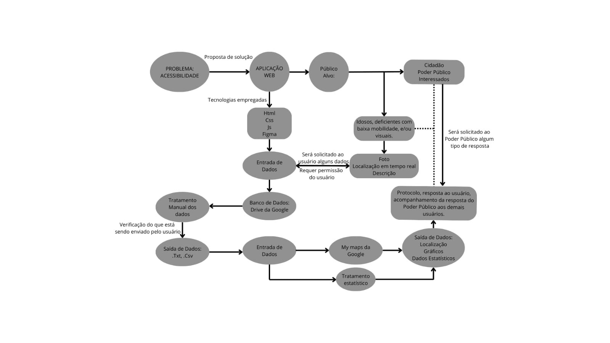

# Especificações do Projeto

## Diagrama

  

## Diagrama de Personas

| EU COMO | QUERO/PRECISO | PARA |
|--------------------|------------------------------------|----------------------------------------|
| USUÁRIO | Ter acesso aos locais que receberam alguma denúncia por falta de acessibilidade quanto à mobilidade urbana. | Manter-me informado(a) |
| USUÁRIO | Registrar uma nova denúncia de um local que possui características que não condizem com normas básicas de acessibilidade. | Denúnciar esses locais |
| USUÁRIO | Receber alguma resposta acerca da correção do problema. | Saber se minha denúncia foi resolvida |
| ADMINISTRADOR | Ter acesso a todas as informações de cada denúncia. | Processar e analisar esses dados |
| ADMINISTRADOR | Publicar dados que gerem publicidade ao problema diante do poder público | Cobrar uma resposta diante do problema exposto pelo USUÁRIO. |

## Histórias de Usuários

- Meu nome é Maria, tenho 23 anos, sou deficiente visual, todos os dias lido com situações de falta de acessibilidade indo ao trabalho, ruas sem guias para cegos, guias pouco planejadas e obstáculos próximos as guias. Sempre dependo muito das pessoas serem empáticas e me auxiliarem no trajeto. Perco minha privacidade e minha independência pela falta do olhar do poder público as pessoas com o mesmo problema.

- Carlos, 38 anos, deficiente paraplegia. No dia-a-dia sempre encontro situação que me colocam em risco, ando praticamente na rua na maioria das principais ruas e avenidas na região metropolitana de Belo Horizonte. Rampas mal feitas próximo a esquinas e perto de bueiros, sistemas de drenagem, situações que colocam em xeque a mobilidade da cadeira, passeios elevados, muito obstáculos, alguns a se comentar lixos e obras são comuns. Queria poder denunciar o descaso e melhorar a vida das pessoas assim como eu que possuem essas limitações.

- Sabrina, 63 anos, dona de casa, possui baixa mobilidade, desgate nas articulações, e reclama da falta de Acessibilidade ao idoso e o descaso da prefeitura com essa população.

## Requisitos Funcionais

| ID     | Descrição do Requisito                                           | Prioridade |
| ------ | -----------------------------------------------------------------| ---------- |
| RF-001 | Permitir com que o usuário faça Login                            | ALTA       |
| RF-002 | Permitir com que o usuário faça Logout                           | ALTA       |
| RF-003 | Cadastrar uma denúncia                                           | ALTA       |
| RF-004 | Registrar uma imagem do local da denúncia                        | ALTA       |
| RF-005 | Listar todas as denúncias                                        | MÉDIA      |
| RF-006 | Listar denúncias por usuário                                     | MÉDIA      |
| RF-007 | Listar denúncias por prefeitura                                  | MÉDIA      |
| RF-008 | Listar denúncias por estados                                     | MÉDIA      |
| RF-009 | Acessar informações sobre a denúncia                             | ALTA       |
| RF-010 | Acessar diversas estatísticas baseadas nos dados cadastrados     | MÉDIA      |
| RF-011 | Acessar mais informações sobre o projeto                         | BAIXA      |
| RF-012 | Acessar informações de contato com os administradores do projeto | BAIXA      |

## Requisitos Não Funcionais

| ID      | Descrição do Requisito                                                                        | Prioridade |
| ------- | --------------------------------------------------------------------------------------------- | ---------- |
| RNF-001 | A imagem deve ter tamanho máximo de (200) MB                                                  | ALTA       |
| RNF-002 | Os usuários não devem ter acesso aos dados específicos do denunciante                         | ALTA       |
| RNF-003 | A persistência ocorrerá de maneira local, no browser do usuário e na própria pasta do projeto | MÉDIA      |
| RNF-004 | A aplicação deve ser responsiva                                                               | BAIXA      |
| RNF-005 | A aplicação deve responder às solicitações e requisitos em no máximo 15s                      | MÉDIA      |

## Delimitação do Projeto

O projeto vai coletar, análisar e exibir os dados proporcionados pelos usuários sobre a falta de acessibilidade na mobilidade urbana no Brasil.
