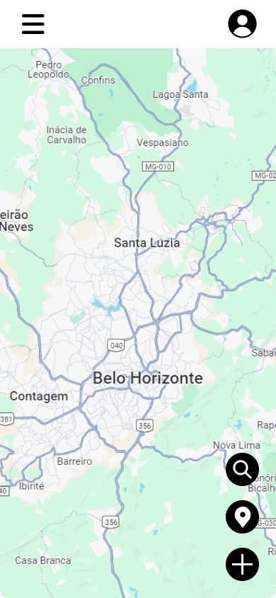

# Template Padrão do Site

  </img>

O código HTML e CSS do template padrão está na pasta "src"

## Documento de Design

[PDF do Documento de Template Padrão](https://sgapucminasbr-my.sharepoint.com/personal/1563044_sga_pucminas_br/_layouts/15/guestaccess.aspx?share=EXlA8gS2PvNIkRrqDKSX8gwB-uPFAZ5CS4BWQLSstQRoug&e=cRTpZ9)

[Apresentação de Slides do Design - FIGMA](https://www.figma.com/design/Cs52PCbXeXXvy4KBChrUPa/E1---Template?m=auto&t=sTuan2CXd2pMO2L8-1)